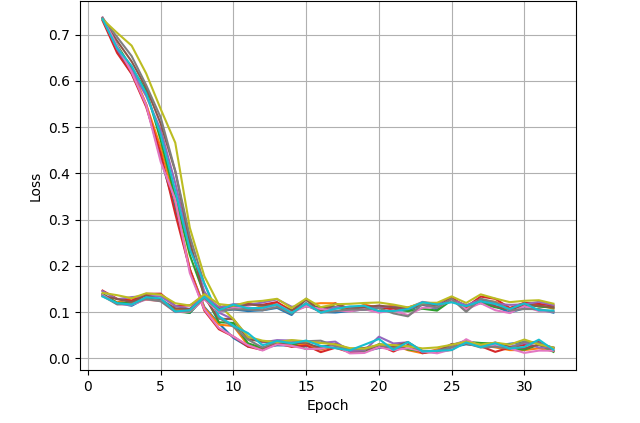
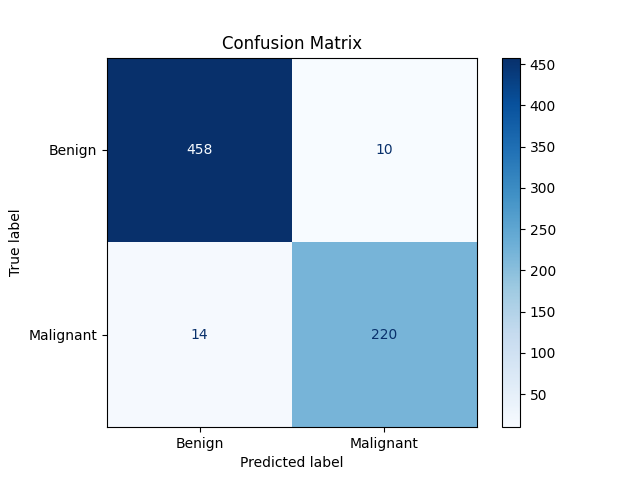
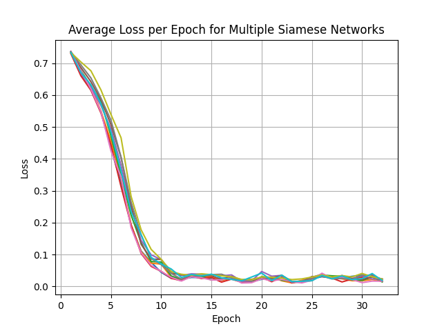

# Siamese Network-based Classifier on ISIC 2020 Resized Dataset

#### Author: Kai Graz, UQ Student Number: 46963868

## Introduction
Medical professionals spend many hours each year examining patients for malignant skin lesions. Working to imitate their abilities, this project aims to classify images of skin lesions from the ISIC 2002 Resized Dataset as benign or malignant, spcifically with a Classifier based on a Siamese Network.

### Datasets used

The ISIC 2020 Resized Dataset (resized to 256x256 JPG files) is a processed data subset of the ISIC 2020 Challenge Dataset. The Resized dataset contains a collection of 256x256 JPG images, and a metadata CSV file. Aside from the resizing itself, the only difference in data is the metadata file, which contains less peripheral information. Additionally, any data without provided ground truths was discarded, as it cannot be used for testing or training.
For use in this project, the images need to be stored all together in a folder, and the metadata file must be available (with no particular storage requirement).
Paths to the folder and to the metadata file can be provided or prompted for.

## Data Preprocessing

Before processing images, the metadata file (containing the ground truths for all images) is read and image names are separated by malignancy. A change in size of the dataset can then be enforced by only maintaining the files of interest. In the interest of avoiding a vast disparity between classes, the number of benign cases was limited to twice the number of malignant cases. This reduces scope to a manageable level for this project, and prevents the model from simply predicting the majority to obtain misleadingly high accuracy.

Loading the data is then as easy as storing references to the pixeldata of the jpg files with the names of the images left over.
In this loading however, we can begin data augmentation:
Each image that is read is stored (or a reference is stored to that image)
And, each image has a horizontally flipped copy (with optional random rotation) stored and saved alongside it's original.

In this way, once the data is loaded we are left with 2 lists and a dictionary: a list of each class containing the names of each image, and it's augmented copy; and a dictionary of names to image Tensors

Train/Test splitting is then as simple as splitting the lists of classes by some index, and then only fetching the corresponding images. A 80/20 split was selected for this dataset by convention (discussion abounds on correct splitting practice[^1], but for the problem at hand it serves as an effective starting point)

Finally, we have a dataset of `3 * #original malignant cases` unaugmented images, and the same number again of augmented images.

### Dataset distribution

| Data | Benign | Malignant | Total
| ------------- | ------------- | ------------- | ------------- |
| Pre-Augmentation | 1168 | 584 | 1752 |
| Post-Augmentation | 2336 | 1168 | 3504 |
| Train (Post-Augmentation) | 1869 | 934 | 2803 |
| Test (Post-Augmentation) | 467 | 234 | 701 |

## Model Architecture 
### Choice of Model
With a Siamese Network as prescribed basis, it was clear that the project needed two different possible forms of output: either a similarity (when provided with 2 images) or a binary classification (when provided with 1 image). To accomodate this a Siamese network would act as the foundation, learning discriminant embeddings in the traditional manner for Siamese Networks (with 2 images), and once a suitable accuracy was achieved the weights would be transfered to a second classifier network capable of classifying individual images.
Although the code used describes 2 separate classes for the different networks, in actuality, the primary difference is in the first Linear layer which is initialized with half the number of expected incoming features and the forward function which takes only a single input. A great deal of the Classifier Network is dierectly inherited from an instance of the Siamese Network.

To learn these discriminant embeddings, a resnet34 was used for feature extraction, and those features fed into a combination of Fully-Connected Linear Layers, ReLU Layers, with dropout (of 0.3 by default) being applied after the first ReLU.
The selection of layers was guided by investigations into (Koch, Zemel & Salakhutdinov 2015)[^2], (Examples/siamese_network/, pytorch/examples 2024)'s example[^3], and the philoshophy of simplicity: begin with a simple model and only increase complexity as necessary, to avoid overfitting.

Binary-Cross-Entropy Loss was used as a loss criterion following the same design philosphy. Although Triplet loss might have been a more traditional approach, BCELoss provided an effective starting point, and never required replacing.
The ADAM optimizer was used with similar reasoning, requiring no changes and providing effective optimisation.

### Hyperparameters

- Batch size: 16
- Learning rate: 0.0002
- Number of epochs: 32

A batch size of 4, 8, 16, 32 and 64 were tested with the model performing best with 16.
Similarly, learning rates from 0.1 to 1e-6 were tested and 2e-4 performed highly most consistently. Although a few others occasionally scored better accuracies, 2e-4 maintained it's high performance most consistently.
An epoch count of 10, 20, 30, 32, 40, 64 and 100 were tested with the model performing best with 30 and 32. Early stopping was not implemented to provide more complete control over the lifetime of the model, but could easily be implemented in future iterations.

All other hyperparameters (such as gamma, dropout rate, etc) were set at a base starting point and left unvaried, following the design philosophy evident in model construction in which a simple baseline was used to avoid overfitting, and only varied when necessary.


## Model Performance 

As a Binary Classification task, the model performance can be easily evaluated with a confusion matrix, or more broadly using an accuracy rating.
Model performance was high once a suitable feature extractor was selected, and the accuracy of both the Siamese Network and the Classifier Network range from 90% to 100% on the unseen test-data.

A graph of losses across epochs from 10 separate model runs can be seen here, along with the confusion matrix of a single model run.

###### Figure 1

###### Figure 2


The collection of losses in Figure 1 starting near 0.7 is from the Siamese network, and as is evident from the figure, the Siamese network takes roughly 12 Epochs to reach a stable plateau of roughly $1 \over 15$ of the original loss. The second collection of losses maintains a loss of roughly 0.12 consistently. The difference in performance between the two models is because the Classifier acts as an extension of the Siamese Network, with pretrained weights already loaded (except for 1 Linear Layer). Because of this it should not be surprising that the Classifier does well: that is the aim of the entire assembly.

The confusion matrix is the matrix of a single model, tested on the 20% tesing split of the data.

Further diagnostic metrics of each run will be printed as below at the end of a models run:
```
Classifier: Average loss: 0.0060
Accuracy: 678/702 (96.58%)
Accuracy: 0.9658
Precision: 0.9565
Recall: 0.9402
F1 Score: 0.9483
```
And with verbose training enabled (True by default), a Models progress will be displayed as below:
```
Train Siamese Epoch: 1 [0/2802 (0.00%)]
Loss: 0.9796696901321411
Train Siamese Epoch: 1 [160/2802 (5.68%)]
Loss: 1.234261155128479
Train Siamese Epoch: 1 [320/2802 (11.36%)]
Loss: 0.7183441519737244
Train Siamese Epoch: 1 [480/2802 (17.05%)]
Loss: 0.7024695873260498
Train Siamese Epoch: 1 [640/2802 (22.73%)]
Loss: 0.6465725898742676
Train Siamese Epoch: 1 [800/2802 (28.41%)]
Loss: 0.7998968362808228
Train Siamese Epoch: 1 [960/2802 (34.09%)]
Loss: 0.7738028764724731
Train Siamese Epoch: 1 [1120/2802 (39.77%)]
Loss: 0.7581069469451904
Train Siamese Epoch: 1 [1280/2802 (45.45%)]
Loss: 0.6827537417411804
Train Siamese Epoch: 1 [1440/2802 (51.14%)]
Loss: 0.6931984424591064
Train Siamese Epoch: 1 [1600/2802 (56.82%)]
Loss: 0.7175575494766235
Train Siamese Epoch: 1 [1760/2802 (62.50%)]
Loss: 0.6808750629425049
Train Siamese Epoch: 1 [1920/2802 (68.18%)]
Loss: 0.6432032585144043
Train Siamese Epoch: 1 [2080/2802 (73.86%)]
Loss: 0.6961710453033447
Train Siamese Epoch: 1 [2240/2802 (79.55%)]
Loss: 0.661441445350647
Train Siamese Epoch: 1 [2400/2802 (85.23%)]
Loss: 0.6602127552032471
Train Siamese Epoch: 1 [2560/2802 (90.91%)]
Loss: 0.7196227312088013
Train Siamese Epoch: 1 [2720/2802 (96.59%)]
Loss: 0.6925568580627441
```
Once the model passes from being a Siamese Network to being a Classifier, the display will change appropriately.

The individual losses of the Siamese and Classification networks can be seen below:
###### Figure 3

###### Figure 4


## How to Use

Before running, please ensure all dependencies are met (python version, python libraries/packages and datasets (torch cuda variant highly recommended).)

## To create a model and run predictions on the test set
```
python predict.py 
```
The result of this will be 2 saved Networks (1 Siamese, 1 Classifier), assorted information printed to pythons standard out, and a confusion matrix window.

## Dependencies

- python (3.12)
- pytorch (2.4.1)
- torchvision (2.4.1)
- matplotlib (3.9.2)
- scikit-learn (1.5.2)
- ISIC Resized Dataset  ISIC[^4]

## References
<!-- I have tried *everything* but the strange lines here do not go away :( -->
[^1]: Reddit - Dive into anything 2016, Reddit.com, <https://www.reddit.com/r/learnmachinelearning/comments/18msvh2/source_of_general_convention_of_8020_traintest/>.
[^2]: Koch, G, Zemel, R & Salakhutdinov, R 2015, Siamese Neural Networks for One-shot Image Recognition, <https://www.cs.cmu.edu/~rsalakhu/papers/oneshot1.pdf>.
[^3]: Examples/siamese_network, pytorch/examples 2024, GitHub, <https://github.com/pytorch/examples/tree/main/siamese_network/>.
[^4]: Nischay Dhankhar 2020, ISIC 2020 JPG 256x256 RESIZED, Kaggle.com, <https://www.kaggle.com/datasets/nischaydnk/isic-2020-jpg-256x256-resized/data>.